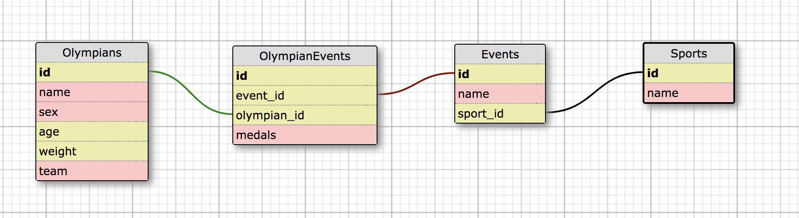

# koroibos

### Introduction
Koroibos is a Mod 4 Project at the [Turing School of Software & Design](www.turing.io) meant to simulate a real-world take-home challenge. We were tasked with importing a CSV and building out a 2016 Olympics API and were given two days to complete the challenge in a new language. This app is built with JavaScript, Express, Node, Sequelize and is deployed on Heroku at "https://koroibos.herokuapp.com/".

### Local Setup
Basic Setup
1. `clone` down this repo
1. `cd` into koroibos
1. Run `npm install` to install dependencies

Database Setup
1. Configure the `config.json` to your postgres username
1. Run `npx sequelize db:create`
1. Run `npx sequelize db:migrate`
1. Run `node data/import.js` to seed the database

### How To Use
1. Run `npm start`
1. Use Postman or visit the site deployed on Heroku at "http://localhost:3000" to hit the endpoints

### API Endpoints
There are six separate endpoints that can be hit from this API. Each endpoint will begin with "http://localhost:3000" (if you're running locally) or "https://koroibos.herokuapp.com/" (if you're hitting from production).

*No request bodies are needed for any endpoint*

1. **All Olympians**

  `GET /api/v1/olympians`

   _Example Response_

        {
        "olympians":
          [
            {
              "name": "Maha Abdalsalam",
              "team": "Egypt",
              "age": 18,
              "sport": "Diving"
              "total_medals_won": 0
            },
            {
              "name": "Ahmad Abughaush",
              "team": "Jordan",
              "age": 20,
              "sport": "Taekwondo"
              "total_medals_won": 1
            },
            {...}
          ]
        }

2. **Youngest Olympians**

  `GET /api/v1/olympians?age=youngest`

   _Example Response_

        {
        "olympians":
          [
            {
              "name": "Ana Iulia Dascl",
              "team": "Romania",
              "age": 13,
              "sport": "Swimming"
              "total_medals_won": 0
            }
          ]
        }

3. **Oldest Olympians**

  `GET /api/v1/olympians?age=oldest`

   _Example Response_

        {
        "olympians":
          [
            {
              "name": "Julie Brougham",
              "team": "New Zealand",
              "age": 62,
              "sport": "Equestrianism"
              "total_medals_won": 0
            }
          ]
        }

4. **Olympian Stats**

  `GET /api/v1/olympian_stats`

   _Example Response_

       {
        "olympian_stats": {
          "total_competing_olympians": 3120,
          "average_weight:" {
             "unit": "kg",
             "male_olympians": 75.4,
             "female_olympians": 70.2
            },
           "average_age:" 26.2
          }
        }

5. **All Events**

  `GET /api/v1/events`

   _Example Response_

       {
         "events":
           [
             {
               "sport": "Archery",
               "events": [
                 "Archery Men's Individual",
                 "Archery Men's Team",
                 "Archery Women's Individual",
                 "Archery Women's Team"
               ]
             },
             {
               "sport": "Badminton",
               "events": [
                 "Badminton Men's Doubles",
                 "Badminton Men's Singles",
                 "Badminton Women's Doubles",
                 "Badminton Women's Singles",
                 "Badminton Mixed Doubles"
               ]
             },
             {...}
           ]
        }

6. **All Event Medalists**

  `GET /api/v1/events/:id/medalists`

   _Example Response_

       {
         "event": "Badminton Mixed Doubles",
         "medalists": [
             {
               "name": "Tontowi Ahmad",
               "team": "Indonesia-1",
               "age": 29,
               "medal": "Gold"
             },
             {
               "name": "Chan Peng Soon",
               "team": "Malaysia",
               "age": 28,
               "medal": "Silver"
             }
           ]
        }

### Testing
This app is tested with the Jest testing framework. To test locally run the following command: `npm test`

### Database Schema

### Tech Stack
- JavaScript
- Jest
- Express
- Node
- Postgres
- Heroku

### Author(s)
[Scott Thomas](www.github.com/smthom05)
